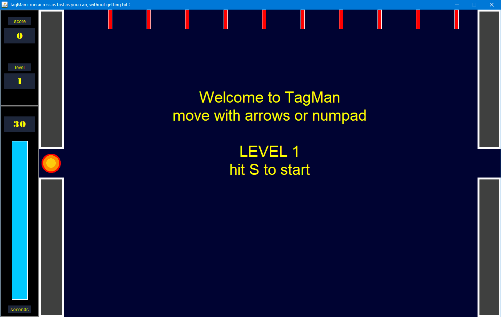

[Download](TagMan jar)



# 🏃‍♂️ TagMan – PROG4 Assessment Game
Java (Swing) • MVC • Timers • Collision Detection • Multi-Level Game

TagMan is a Programmeren 4 assessment in which you develop a complete Java Swing game following an MVC architecture. The goal of the game is simple but challenging: run from the left side of the screen to the right as fast as possible, while avoiding falling dashes and navigating walls.

Your score is the number of seconds left when you reach the finish. Completing all levels ends the game. Being hit by a dash immediately results in Game Over.

---

## 📁 Project Structure

```text
TagMan/
│
├── src/
│   ├── app/
│   │   └── Main.java
│   │
│   ├── controller/
│   │   ├── MainController.java
│   │   └── TimeController.java
│   │
│   ├── model/
│   │   ├── Dash.java
│   │   ├── Game.java
│   │   ├── GameObject.java
│   │   ├── TagMan.java
│   │   └── Wall.java
│   │
│   ├── view/
│       ├── ContentPane.java
│       ├── GameView.java
│       ├── MainFrame.java
│       ├── PlayView.java
│       ├── TagManPainterPlain.java
│       └── TimeView.java
│
├── logo.gif
├── TagMan.jar
├── TagMan_AKD.jpg
├── TagMan_play_for_7_won.gif
├── PROG4_Assessment_TagMan_opgave_v1.0.pdf
└── PROG4_Assessment_TagMan_requirements_v1.0.pdf

```

---

# 🎮 Game Description

Each level includes:
- A 30-second timer that visually decreases over time
- A player that can move right, up, down, or diagonally (but never left!)
- Walls that the player must navigate around
- Falling dashes that drop randomly to block your path
- A finish line that ends the level and awards your score

Movement controls:
- Arrow keys: Up, Right, Down
- Numpad: 8 (up), 9 (up+right), 6 (right), 3 (right+down), 2 (down)
- S = Start level
- L = Load next level
- ESC = Immediate quit (always active)

If the player reaches the finish:
- The player changes color
- A message displays the level score

If the player is hit by a dash:
- Game Over is triggered instantly
- The total score is shown

---

# 📘 Requirements Summary (from the assignment)

## Requirements for a 7
- Main class launching a MainController
- MainFrame extends JFrame, non-resizable, titled “TagMan by <your name>”
- ContentPane switches between PlayView, GameView, TimeView
- GameView shows the total game score and current level
- TimeView shows seconds remaining and a color-changing time bar (30 → 0)
- TimeController manages the countdown timer and updates TimeView
- Player (TagMan) drawn as a circle of three color bands
- Walls and dashes implemented as GameObjects
- Dashes fall once per level with random timing and speed
- Collision detection using intersects(...) methods
- Two levels required

## Requirements for an 8
- Everything from the 7
- Add level 3 and 4 with new wall layouts
- Animated player frames (running, finished, hit)
- Sound effects for finish and hit
- ITagManPainter interface with two implementations: TagManPainterPlain and TagManPainterAnimated

## Requirements for a 9
- Level layouts stored in .txt files
- User can load custom level files through a file chooser
- Validation of corrupted or incorrect files
- Flexible external level formatting

## Requirements for a 10
Bonus features such as:
- Dash variations (speed changes, multiple passes, upward movement, etc.)
- Fully resizable window with responsive UI
- Custom level editor allowing users to build their own stages
- Any creative additional features that enhance gameplay

---

# ▶️ Running the Game

To play the game, run the included TagMan.jar file on your system that supports Java.  
Alternatively, import the project into any Java IDE (Eclipse, VS Code, IntelliJ) and run the Main class.
```text
java -jar TagMan.jar

```
---

# 📸 Included Media

- TagMan_AKD.jpg – assignment visual
- TagMan_play_for_7_won.gif – example gameplay
- PDFs with the full assignment explanation and requirements

---

# 👤 Author
Ferran Hendriks  
PROG4 Assessment Project

---

# 📄 License
This project is intended for educational use as part of the Programmeren 4 assessment.
